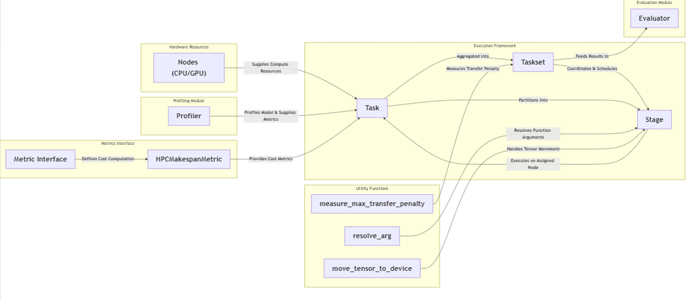

# PyDart

PyDart is a lightweight experimental framework for studying and optimizing multi-model inference execution and scheduling across shared compute resources. It is designed to make it easy to compare simple baseline execution against PyDart's scheduled parallel execution, while keeping the workflow minimal and understandable.

> **Note:** This repository is currently intended as a demo / experimental research framework.

## Current Scope

PyDart currently supports:

- Built-in model-registry-based experiments
- Manual Python workflows for custom models and custom task construction
- Baseline execution through `run_baseline_execution(mode=...)`
- Scheduled parallel execution through the PyDart task execution pipeline

The codebase is structured so that simple experiments can be run from the CLI, while more advanced or custom experiments are better handled through Python scripts or notebooks.

At present, the most stable and recommended baseline mode for testing is **sequential**. An **async** baseline path is also supported for stronger fully parallel comparison, but it may place more stress on the host system at higher workloads.

## What PyDart Helps You Explore

PyDart is designed to help users explore concurrent multi-model execution on their own system in a simple way. It can be used to study how task composition, batch size, and workload mix affect runtime behavior, and how PyDart can intelligently partition and schedule tasks using custom metrics.

At the moment, custom metrics are not directly exposed through the minimal CLI workflow. To explore or extend that part of the framework, refer to `metrics.py`.

See [Installation](#installation) to set up the environment, or jump to [CLI](#cli) and [Python for Custom Workflows](#python-for-custom-workflows) to start running experiments.

## Repository Structure

```text
PyDart_temp/
├── configs/         # Experiment configuration files
├── examples/        # Example Python scripts
├── notebooks/       # Notebook demos and experiments
├── outputs/         # Main output folder
├── src/pydart/      # Core PyDart package
├── README.md
├── pyproject.toml
└── System_Diagram.png
```

### Quick Repo Guide

- `src/pydart/` contains the main framework code
- `examples/` is the best place to look for custom Python usage
- `notebooks/` is useful for demo-style exploration and experimentation
- `outputs/` is the primary location for generated artifacts such as traces, logs, profiling CSVs, and experiment results

This structure is intended to make the repo easy to navigate: core code in `src/pydart/`, runnable examples in `examples/`, interactive exploration in `notebooks/`, and generated results in `outputs/`.

## Execution Model

At the moment, PyDart compares a baseline execution path against PyDart's scheduled parallel execution.

### 1. Baseline Execution

This is handled through `run_baseline_execution(mode=...)` in `Evaluator`.

#### Sequential baseline

This is the current primary and most stable baseline mode.

In this mode:

- Tasks are executed one by one
- Each task is run in a simple sequential loop
- Execution time, completion time, outputs, and makespan are recorded
- This acts as the default baseline for comparison

#### Async baseline

An async baseline is also supported.

The intended purpose of this mode is to represent a more aggressive host-side parallel launch strategy, where tasks are submitted asynchronously as a baseline against PyDart's structured scheduling.

In practice:

- It can provide an extra comparison point than sequential execution
- It may stress the system more heavily than sequential mode, especially at higher workloads
- It is best used when the machine has enough available CPU / GPU resources and comparable workloads
- Sequential mode remains the safest and most recommended option for routine testing

### 2. PyDart Partitioned & Scheduled Parallel Execution

This is the current `run_parallel_execution()` path in `Evaluator`.

In this mode:

- Tasks are assigned through the PyDart execution framework
- The `Taskset` executes tasks across workers / nodes
- Outputs, per-task execution times, completion times, and makespan are collected
- This is the main framework-driven execution path

## System Diagram



> **Note:** The current diagram is older and will be updated.

## Installation

### Requirements

- Python 3.9+
- `pip`
- A supported PyTorch installation for your platform and device

> **Important**
> - It is strongly recommended to use a virtual environment before installing PyDart.
> - PyTorch should be installed **separately first**, using the correct build for your platform (CPU or CUDA), before installing or running PyDart.
> - For PyTorch installation instructions, use the official guide: https://pytorch.org/get-started/locally/

### Setup

1. **Clone the repository**
   ```bash
   git clone https://github.com/parthshinde1221/PyDart_temp.git
   cd PyDart_temp
   ```

2. **Create and activate a virtual environment**

   Using `venv`:
   ```bash
   python -m venv .venv
   source .venv/bin/activate
   ```

   On Windows:
   ```bash
   .venv\Scripts\activate
   ```

3. **Install PyTorch first**

   Follow the official instructions for your platform:
   https://pytorch.org/get-started/locally/

4. **Install PyDart**
   ```bash
   pip install .
   ```

5. **Verify the installation**
   ```bash
   pydart --help
   ```

## CLI

PyDart provides a minimal CLI for built-in experiments.

The CLI is intentionally small and only exposes the simplest built-in execution paths using the default model registry.

### Commands

1. **Show CLI help**
   ```bash
   pydart --help
   ```

2. **Run a single built-in experiment**
   ```bash
   pydart run --workers 2 --ratio 1:1 --tasks 8 --baseline-mode sequential
   ```

3. **Run multiple built-in experiments**
   ```bash
   pydart sweep --workers 2 --tasks 8 --baseline-mode sequential
   ```

### Baseline Mode

PyDart supports configurable baseline execution through the CLI using `--baseline-mode`.

Expected baseline modes include:

- `sequential` — recommended default for testing; simpler, safer, and more stable for most systems
- `async` — also supported and useful for stronger fully parallel comparison, but it may stress the host system more at higher workloads

#### Recommendation

- Use `sequential` for routine testing and the most stable baseline comparison
- Use `async` when you want a more aggressive parallel baseline and your system has enough available resources

Examples:

```bash
pydart run --workers 2 --ratio 1:1 --tasks 8 --baseline-mode sequential
```

```bash
pydart run --workers 2 --ratio 1:1 --tasks 8 --baseline-mode async
```

## Python for Custom Workflows

Use Python scripts or notebooks when you want to:

- Define custom `nn.Module` models
- Define custom `ModelSpec` objects
- Create custom dataloaders
- Control tracing manually
- Build tasks explicitly
- Profile tasks manually
- Experiment with evaluator logic directly

This separation keeps the CLI minimal while still letting PyDart act like a flexible library.

### Running Custom Python Files

For custom experiments, run one of the provided example files directly:

```bash
python examples/custom_model_run_sequential.py
python examples/custom_model_run_async.py
```

You can also add your own custom run file under `examples/` and execute it in the same way:

```bash
python examples/<custom_run_file>.py
```

Refer to `examples/custom_model_run_sequential.py` and `examples/custom_model_run_async.py` for example custom workflows.


## Outputs

PyDart organizes generated artifacts by workflow type.

- `outputs_built_in_run/` is used for CLI-based single built-in runs
- `outputs_custom/` is used for custom Python-based runs
- `outputs/` is used for sweep or `run_multiple_experiments` style runs, including artifacts such as traces, plots, summaries, and related experiment outputs

Depending on the workflow, generated artifacts may include:

- traces
- logs
- profiling CSVs
- plots
- experiment results

This structure helps separate built-in, custom, and multi-experiment outputs more clearly.

## Notes

- The repository is currently demo-oriented and experimental.
- The CLI is intentionally minimal.
- `sequential` is the recommended baseline mode for most users and for routine testing.
- `async` is also supported and can provide a stronger comparison point, but it may stress the system more at higher workloads.
- For custom models and more advanced workflows, prefer Python scripts or notebooks.
